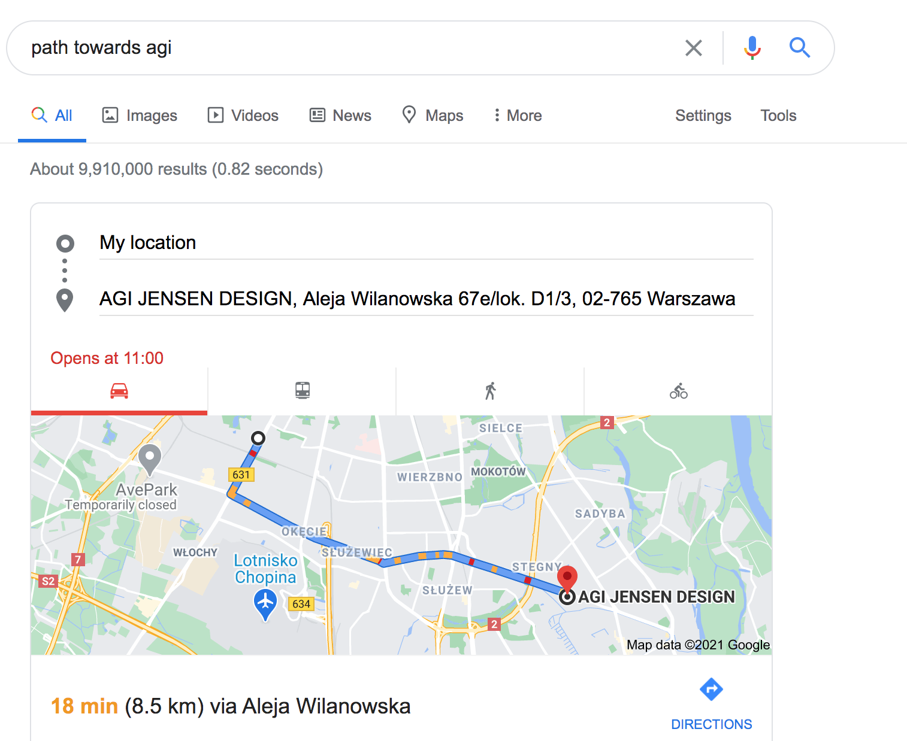

# Deep Learning with Multiple Objectives

Welcome to the lab! In this course, we will delve into one area of limitations of the current incarnation of deep learning technologies, while being optimistic about what is already possible.

There will be three separate modules. In the **first module** of the course, we will focus on learning in a stationary setting where the neural network learns each objective at the same time.  to We will have multiple competing objectives. Investigating this, we will better understand how deep neural networks are trained, and what are some limitations.

In the **second module**, we will focus on life-long learning. How do we learn over course of multiple tasks? This seems to be a necessary capability on the path to artificial general intelligence. 

In the **third module**, we highlight several solutions, most likely focusing on meta-learning, modularity (including computational computation). These two solutions were shown to help deep network learn multiple objectives both in the sequential and stationary setting.

## Labs

* (26.02) [Lab 1: 01-transfer](https://colab.research.google.com/drive/1y1Jh2JPjCgr6ccvmwk6iN6SaJWv143Qt?usp=sharing )

* (05.03) [Lab 2: 02a-transformers](https://colab.research.google.com/drive/1qq8_7ycu4_rb4GS-BYkfKJlRbA1JVkUH?usp=sharing)

    - Deadline for Lab 1 homework (2p, reading assignment).

* (12.03) [Lab 3: 02b-transformers](https://colab.research.google.com/drive/1pvXFV8o-G5Dr4Uwr5xVZSwB-Q7NJGlw6?usp=sharing)

    - Deadline for Lab 2 homework (2p, reading assignment and mini-project ideas).

* (19.03) [Lab 4: 02c-transformers](https://colab.research.google.com/drive/1_RLws7wisxkCDv0Q4mfKVsLQKBFl-j6K?usp=sharing)

    - Deadline for Lab 3 homework (3p, 02a-transformers notebook and mini-project description).

* (26.03) [Lab 5: 03-miniproject-consultation](https://colab.research.google.com/drive/1kuFPkfMlMz9LqVskNoIJW3q1Y9n8Vrnu?usp=sharing)

    - Deadline for Lab 4 homework (1p, 02c-transformers notebook).

* (9.04) [Lab 6: 04a-shortcut-learning](https://colab.research.google.com/drive/1rnvNexj9HAyBUwrbX6K5mEgn4dSWHqhr?usp=sharing)

* (16.04) Lab 7: Mini-Project presentation

* (23.04) [Lab 8: 04b-shortcut-learning](https://colab.research.google.com/drive/1Cll5gmmHv2oDXzNMgEHcyq2tla5SjQU4?usp=sharing)

* (30.04) Project consultation

* (7.05) [Lab 9: 05a-continual-learning](https://colab.research.google.com/drive/1Iwh6LPd1Srboibj_QqSOVvTq1ALMdbB2?usp=sharing)

* (14.05) Lab 10: Finishing 05a-continual-learning and project consultation

* (21.05) Lab 11: Project midterm presentation

    - Deadline for Lab 9 notebook.

* (28.05) Lab 12: [05b-continual-learning](https://colab.research.google.com/drive/1WiDb9vZmAUGxDCDeKyvT9-dk_WBpzwY1?usp=sharing)

* (04.06) Lab 13: Final Project consultation and working in groups

* (11.06, extended) Lab 14: Final Project presentations

    - Note: Format will be announced later.

## Important links

* [Main Spreadsheet](https://docs.google.com/spreadsheets/d/1tSO1ZlILxmD0LuMFZ3GLyJmtiJgMnJg0okkA43N_9AU/edit?usp=sharing)

* [Anonymous Feedback](https://forms.gle/bP7EymPrknE3MKaT7) 
    - this is fully anonymous (you can fill it up without being logged to Google account)

* [Teams](https://teams.microsoft.com/l/team/19%3a4cbff8c281134f2f8997612796e81415%40thread.tacv2/conversations?groupId=c1c10036-51ad-4303-9d2f-fe9c6b666bb7&tenantId=eb0e26eb-bfbe-47d2-9e90-ebd2426dbceb) 
    - for lecture, and lab in case gather.town doesn't work

* [Whiteboard](https://cocreate-005.gather.town/r/tRrxB4rpgurrpc62y)

* [Mini Projects](https://docs.google.com/document/d/1vuCS-liGXCx7I0oSX4liyTFEUEYZtQszMgaTbg-aJWU/edit?usp=sharing)

* [Final Project](https://docs.google.com/document/d/1Nql78Gwn-sYrZDVNWjzE6yonjBjDoPx9cjCM8qSv3uA/edit?usp=sharing)

Please do not enter your personal information when logging into Gather.town (or in the spreadsheet).

## Goal

* Understand challenges that deep learning faces

* Understand key classes of solutions to these challenges

    - Hands-on experience applying transfer learning models
 
* Understand key research directions that will shape the future of deep learning

    - Read and discuss papers
    
    - Reproduce one paper as a project 

## Office Hours

I am available immediately after the lab for office hours.

## Requirements

* Completing Machine Learning or Neural Networks course, or **demonstration** of equivalent knowledge

## Lab

* Approximately 50% of our labs will be devoted to working on a project and consulting it throughout the semester. 

* You will be working on the project in groups of 2-3. 

* We will try to use gather.town. Your feedback is essential: we can switch to teams if you prefer. Why gather.town:

    - Pernament whiteboard
    
    - Easy to see where I am during consultation
    
    - Easy to ask question privately
    

## Project and Mini-Project

* Your grade will largely depend on completing a Project and a Mini-Project 

* The Mini-Project will focus on Transfer Learning
    
    * Preferred topic is using GPT-2, Vision Transformer, or CLIP in some context
    
        - See [this list](https://www.reddit.com/r/MachineLearning/comments/ldc6oc/p_list_of_sitesprogramsprojects_that_use_openais/) for inspiration

* The Project will be carried out in groups of 2 to 3 students

    * Preferred topic is reproducing a highly cited or accepted into a prestigious conference paper that addresses any of the challenges
    discussed in this course. See https://reproducibility-challenge.github.io/neurips2019.
    
    * Specific topics for the Project will be announced later, and feel free to suggest your own
    
    * Every two labs devoted to project you will be asked to show your progress and describe your next tasks.

## Attendance

- Attending labs is required (2 abstences are OK, more are of course possible but please reach out with an explanation)

- Attending lectures is optional

## Lab Grading

Your grade will be based on:

- (25%) Completing a few small exercises (3-4) including reading papers. 

    Exercises have to be submitted by Thursday midnight via email.

- (25%) Miniproject 1: We will together work on a specific topic and explore few ideas around it that illustrate concepts in Stationary World

- (50%) Project
    
Specific gradient for Project and Mini-Project will be announced later.

Each week past the deadline for a given homework results in a 25% penalty point penalty.

Your grade will calculates as follows:

* 0-49%: 2

* 50-59%: 3

* 60-69%: 3,5

* 70-79%: 4

* 80-89%: 4,5

* 90-100%: 5

## Final Grade

Final grade will be based on:

- Exam

- Lab Grade

- (Only PhD students) Lecture (PhD students will be required to prepare a lecture)

We will announce details on exam later, but we can already say that an important component will be understanding papers
discussed during the lab.

## Compute

* You will need at least a single GPU. Google's Colab seems to be the best option

  - Paperspace looks interesting but I found it has a very long startup time.
