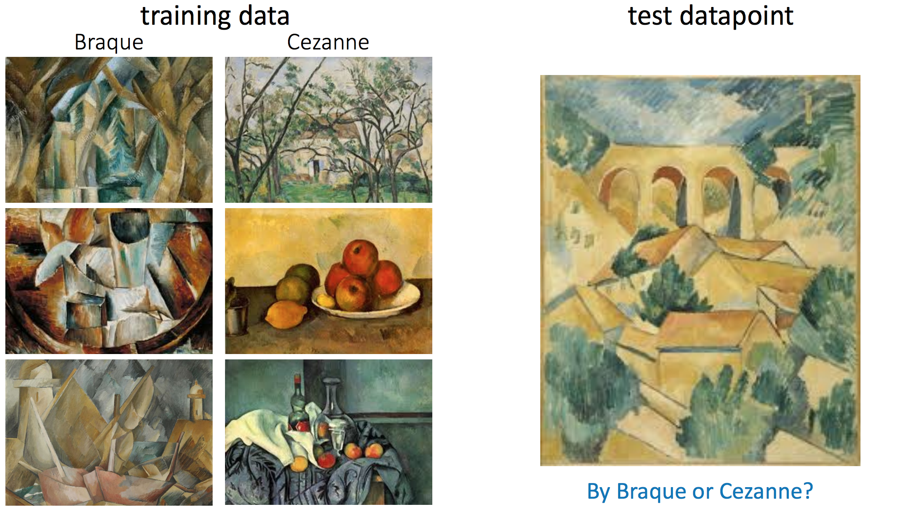

# Deep Learning with Multiple Objectives

Deep learning in its current form does not seem sufficient to achieve Artificial General Intelligence. In this course, we will delve into one area of limitations of the current incarnation of deep learning technologies, while being optimistic about what is already possible.

There will be three separate modules. In the **first module** of the course, we will focus on learning in a stationary setting where the neural network learns each objective at the same time.  to We will have multiple competing objectives. Investigating this, we will better understand how deep neural networks are trained, and what are some limitations.

In the **second module**, we will focus on life-long learning. How do we learn over course of multiple tasks? This seems to be a necessary capability on the path to artificial general intelligence. 

In the **third module**, we highlight several solutions, focusing on meta-learning, modularity (including computational computation). These two solutions were shown to help deep network learn multiple objectives both in the sequential and stationary setting.

## Compute

* You will need a single GPU. Paperspace or Colab or personal. 
  - If using Colab, please make sure you turn off the machine after each class. Otherwise you might end up deprioritised, and some labs might be difficult to do without GPU.
  - My recommendation: use Paperspace but if difficult to launch before class switch to colab. Paperspace is more like a persistent machine, so I think you will like it more.

## Lab

Around 50% of time will be devoted to working on a project and consulting it throughout the semester. You will be working on the project in groups of 2-3. 

Your grade will be based on:

- Completing a few small exercises (3-4) including reading papers 
- Reading papers is scored in a tricky way: you might be asked to give a short summary of a paper (no presentation)
- Miniproject 1: We will together work on a specific topic and explore few ideas around it that illustrate concepts in Stationary World
- Project: Each group will work on a project

I recommend Paperspace or Colab. Paperspace has a persistent storage, but sometimes takes long to launch.

We will try to use gather.town.

## Grading

